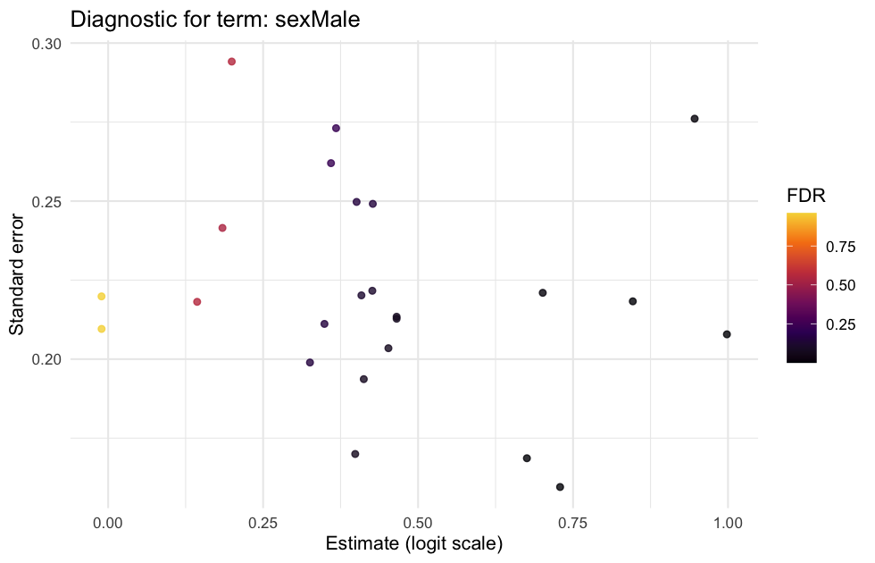

# ASPENGLMS

[](https://github.com/Muquesting/ASPEN_GLMS/actions/workflows/R-CMD-check.yaml)

**Covariate-aware allele-specific expression analysis in R.** Fit per-gene
beta-binomial mixed models to allelic counts in `SingleCellExperiment` objects,
inspect model diagnostics, shrink coefficients, and adjust p-values by coefficient.

ASPENGLMS is early-stage research software. It is inspired by
[ASPEN](https://github.com/ewonglab/ASPEN), but is a separate project maintained by
[Muquesting](https://github.com/Muquesting). It is not an official upstream release.

## Install

Install a current R release and, when building from source, its platform's build
tools. Bioconductor packages require a Bioconductor version compatible with R.

```r
install.packages(c("BiocManager", "remotes"))
BiocManager::install(c("SingleCellExperiment", "SummarizedExperiment", "apeglm"), ask = FALSE)
remotes::install_github("Muquesting/ASPEN_GLMS", upgrade = "never")
```

During development, use `ref = "codex/oss-application-readiness"` in the GitHub
installation command. Install a published release by specifying its tag in `ref`.

## Run a complete synthetic example

```r
library(ASPENGLMS)
source(system.file("scripts", "demo_pipeline.R", package = "ASPENGLMS"))
```

The seeded example creates 24 synthetic genes across 480 cells from 24 donors;
sex and age are assigned at donor level. No private datasets or API credentials
are required. It writes three tables and an optional diagnostic plot to `results/`:

| Output | Contents |
| --- | --- |
| `glmm_results.tsv` | Coefficients, standard errors, p-values, convergence and failure messages |
| `sex_shrinkage.tsv` | Shrunk sex coefficients and local false-sign rates |
| `contrasts.tsv` | Usable coefficient rows with BH-adjusted p-values, separately by term |
| `coefficient-diagnostics.png` | Estimate/standard-error plot when ggplot2 is installed |



*Output from the seeded synthetic demo on R 4.6.1/macOS. These are simulated
coefficients, not biological findings or a calibration benchmark.*

See the [walkthrough](docs/tutorial.md) for input construction and interpretation.

## Analyse your data

```r
# sce: SingleCellExperiment containing a1 (successes) and tot (total counts)
# colData(sce): donor-level condition and donor identifiers
fit <- fit_glmm_bb(sce, ~ condition, rand = "(1|donor)", ncores = 1)
fit[!fit$converged, c("gene", "error")]
shrunk <- shrink_with_ash(fit, term = "conditiontreated")
adjusted <- tidy_contrasts(fit)
```

Counts must be finite nonnegative integers with `a1 <= tot`. The formula's
covariates must be complete and present in `colData`. A successful fit requires
optimizer success, a positive-definite Hessian, and finite coefficient statistics.
Failed genes remain explicit failure rows and are excluded from inference.

## Scientific limits

- Wald statistics and empirical Bayes summaries do not establish calibrated
  inference for every design. Assess replication, confounding, model fit, and
  multiple-testing assumptions for your experiment.
- Cells are not independent biological replicates. Choose a design and random
  effects appropriate to the sampling process.
- `tidy_contrasts()` adjusts coefficient tests; it does not construct arbitrary
  linear contrasts. Correction is within each term, not across all terms.
- Inverse-logit of an intercept can describe a baseline allelic probability.
  Inverse-logit of a non-intercept coefficient is not a group allelic ratio;
  use `exp(beta)` for an odds ratio and the complete linear predictor for probabilities.
- `apeglm_bb()` is an experimental fixed-effects interface. It requires
  `param = cbind(theta, Y_tot)` with independently supplied positive concentration
  estimates and cannot replace mixed-model coefficient shrinkage. No performance
  advantage or scientific validation is claimed.

## Reproduce and contribute

The development `renv.lock` records the dependencies actually used by Linux CI.
For a checked-out release, install `renv`, run
`source("tools/configure_repositories.R")` to select the tested public
Bioconductor mirror, then run `renv::restore(prompt = FALSE)`,
then `renv::load()` to activate the project library, and install this source package
with `install.packages(".", repos = NULL, type = "source")`. If CRAN binaries
report a TMB version mismatch, rebuild the locked version before loading this
package: `renv::install(paste0("glmmTMB@", packageVersion("glmmTMB")), type = "source", rebuild = TRUE)`.
Use the R and Bioconductor versions recorded in the lockfile; system build tools
remain platform-specific. See [contributing](CONTRIBUTING.md) and the
[roadmap](ROADMAP.md). Report reproducible bugs through GitHub Issues using
synthetic data. If the package is useful to your work, a star helps others find it.

## Licence and citation

MIT; see [LICENSE.md](LICENSE.md). Existing copyright notices and upstream attribution
are preserved. Cite this repository and the specific version you used (see
[CITATION.cff](CITATION.cff)), together with the underlying statistical methods.
